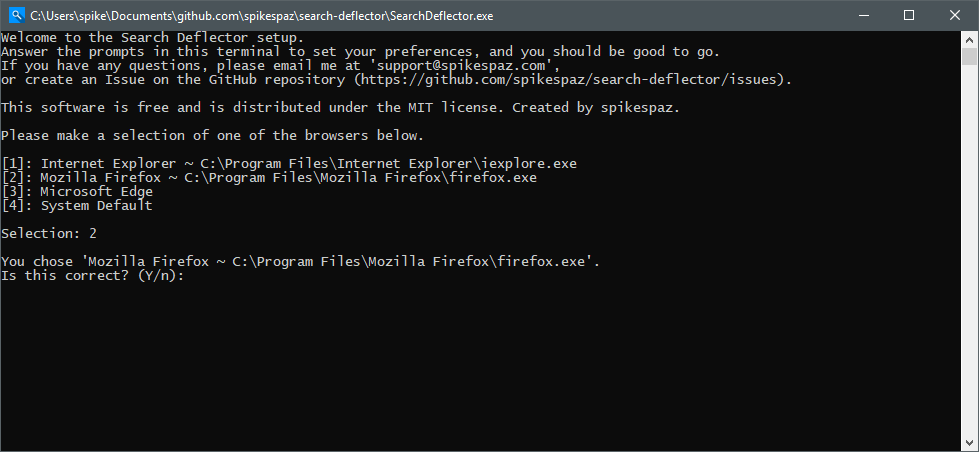
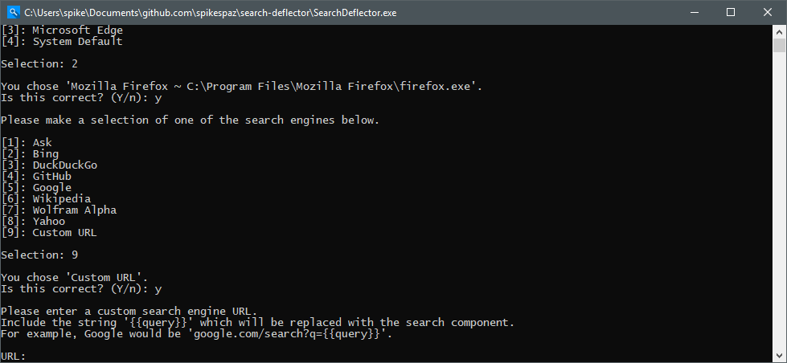
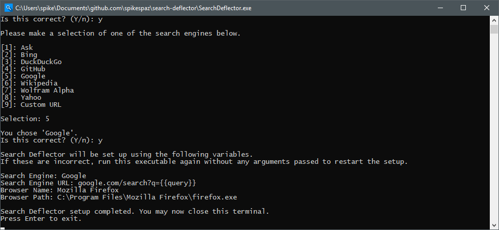

# Search Deflector

This is a small program that will redirect searches made with Cortana to your preferred browser and search engine. While this software is extremely similar to Edge Deflector and Search With My Browser, it allows the user to use any search engine they want and select any installed browser--not just the system default.

## Donations

If you would like to show appreciation for my work, I would gladly accept a small donation!

I will accept donations through PayPal.Me, Buy Me a Coffee, or Patreon.

## Setup

The setup is simple. Extract the zip file to a location where you can find it again, and follow the instructions below.

Some examples I would recommend are `C:/Program Files/Search Deflector/` or `C:/Utilities/`.

Then, right click `SearchDeflector.exe` to open the context menu and choose "Run as administrator". A console window will open, and look something like below.

### 1. Choosing a browser

In the below screenshot, I have selected option 2 for Firefox. Search Deflector will scan your registry for programs that are capable of handling URL protocols, and list them for you to choose. Just enter the number in square brackets next to the browser you want. Press Enter, and then Y or N to confirm or pick again.

### 2. Choosing a search engine

Same as the browser, select the search engine you would like to use. If the search engine you want is missing, please create a [new issue](https://github.com/spikespaz/search-deflector/issues/new) and request that it be added, or fork the repository and add it to [`engines.txt`](https://github.com/spikespaz/search-deflector/blob/master/engines.txt), then submit a pull request.

See [the next section](#3-using-a-custom-url) for details on the last option, "Custom URL".

### 3. Using a custom URL

If you chose the last option, "Custom URL", in the previous step, keep reading. Otherwise, skip to the next section.

Here, you can enter a custom URL to use as a search engine. It must include the string `{{query}}`, which will be replaced with your search URI component. Please do not enter the `https?://` protocol part of the URL, it will be ignored. See [`engines.txt`](https://github.com/spikespaz/search-deflector/blob/master/engines.txt) for examples on the format.

The program will then check the validity of your input by sending a GET request to the URL. If it succeeds and returns 200, you can move forward.

If you use this option, please create a [new issue](https://github.com/spikespaz/search-deflector/issues/new) and request that it be added, or fork the repository and add your search engine to [`engines.txt`](https://github.com/spikespaz/search-deflector/blob/master/engines.txt), then submit a pull request.

### 4. Finishing the setup

The setup is complete. Make sure that the information listed is what you expected it to be. If it isn't, select all of the console output and paste it into a [new issue](https://github.com/spikespaz/search-deflector/issues/new) on GitHub. That is unintentional. If there was a crash before you get to this point, do the same.

# Building

You need a D compiler. I recommend `DMD`, if you have that you can just run `build.sh` with MinGW or Git Bash. Read the build script to figure out what needs to be done.

You need `rcedit.exe` on your system `PATH` variable to add the icon to the executable. Get that from https://github.com/electron/rcedit.

